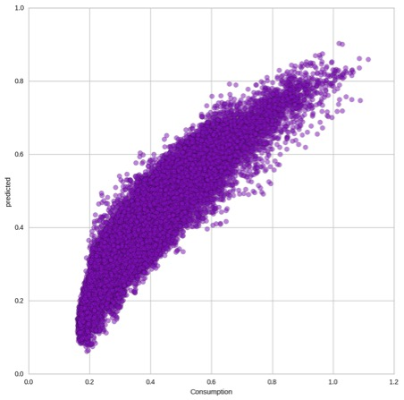
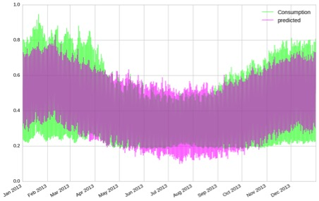
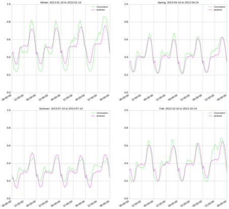

# Taming the Peak 
## -Temporal analysis of the impact of weather and income on the energy consumption pattern of London households. 

###### The observed values and predicted values are roughly on 45-degree lines, meaning that the prediction is somewhat accurate overall. 

###### Timeline Visualization of Observed vs Predicted (Zoomed). Overall, the prediction does not match the magnitude and shrinkage perfectly on the actual values over time, but they have a lot of overlap. 

###### The predicted values are mostly near the actual values, while the values in winter seem to be deviating from each other a bit more than in the other seasons. 

### Auhtors: 
Avikal Somvanshi (as10724), Chongyang Chen (cc5502), Hrafnkell Hjörleifsson (hh1713), Le Xu ([Github](https://github.com/lx565)) and Victor Sette Gripp (vsg247) 

### Description

Our Goal is to explore the relationship/pattern between energy consumption and external temperature conditions, to help predict and manage the future of energy distribution and placate energy demand.
Our Motivation: nncreasing energy consumption is one of the major contributors to greenhouse gases causing Climate Change. According to United Nations Environment Programme residential and commercial buildings consume approximately 60% of the world’s electricity and about 40% of global energy1. Therefore, it is critical to understand the consumption patterns and factors impacting it. 

### Research questions 
How weather and income influences hourly energy consumption? 
Is it possible to predict energy consumption given information about the weather, time stamp and household income? 
Can we predict a household’s income level based on their energy consumption pattern?

### Conclusions
It is well established that energy consumption is a function of time, climate and income among other factors and this relation largely holds good at annual and national level. Our study shows that we can model this relation even at hourly and household resolution with decent accuracy.  Including spatial and architectural/physical data about the households can further improve our model, which was not available for this study. Overall, it can be concluded that city agencies and energy utilities can fairly predict their hourly energy demand based on our model, which can help improve and optimize energy management. Better understanding of consumption and its relationship with climate and physical environment can help tame the peak energy demand. 

### Next steps
Incorporating spatial data into our analysis might give valuable information into the effect of the built environment on energy consumption of households. That information should raise the prediction powers of our models, both the multivariate and the logistic regression.
A comparative analysis between cities would give interesting insight into both different behavior (comfort aspirations indoors) based on location and also make it possible to compare insulation of households based on the time lag between outside temperature and changes in energy consumption.
Study needs to be repeated for cities in different climate and income regions to refine the model for regional differences. 

Project Valuation By Prof. Stanislav Sobolevsky
## Above 93%, Excellent
